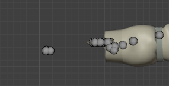
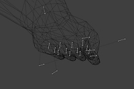
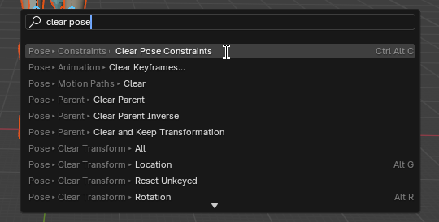
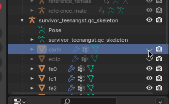

# L4D2 Portin To Garry's Mod
Это пособие как нужно портировать модельки выживших из Left4Dead 2 в игровые модельки игрока Garry's Mod

# Содержание
* [Необходимые программы и файлы](#необходимые-программы-и-файлы)
* [Настройка программ](#настройка-программ)
* [Как скачать файлы из воркшопа](#как-скачать-файлы-из-воркшопа)
* [Как распаковать аддоны](#как-распаковать-аддоны)
* [Компиляция и декомпиляция](#компиляция-и-декомпиляция)
* [Как вставить Source Engine файлы в Blender](#как-вставить-source-engine-файлы-в-blender)
* [Как экспортировать Source Engine файлы из Blender](#как-экспортировать-source-engine-файлы-из-blender)
* [Как нормализовать модельки через Blender](#как-нормализовать-модельки-через-blender)
* [Изменение *.QC файла](#изменение-qc-файла)
* Текстуры (VMT и VTF)
* Как делать bodygroups
* Написание Lua файлов
* [Добавление NPC](#добавление-npc)
* Портирование моделек для PAC3 из Gmod мастерской
* [Работа в блендере](#работа-в-блендере)

# Необходимые программы и файлы
## 1. Crowbar
Ссылка на скачивание программы [Releases · ZeqMacaw/Crowbar](https://github.com/ZeqMacaw/Crowbar/releases)  
Это программа для декомпиляции, компиляции и просмотра моделей  на Source и GoldSource с удобным интерфейсом и открытым кодом.  
Ссылка на страницу в Valve: [Crowbar - Valve Developer Community](https://developer.valvesoftware.com/w/index.php?title=Crowbar)
## 2. GCFScape
Ссылка на скачивание программы [GCFScape](https://gamebanana.com/tools/26)  
GCFScape - это инструмент для просмотра и извлечения файлов из архивов ресурсов игр Quake, GoldSrc и Source.  
Ссылка на страницу в Valve: [GCFScape - Valve Developer Community](https://developer.valvesoftware.com/wiki/GCFScape)
## 3. VTFEdit
Ссылка на скачивание программы [VTFLib/VTFEdit v1.3.3](https://gamebanana.com/tools/95)  
VTFEdit - инструмент для просмотра, редактирования и создания файлов VTF и VMT.  
Ссылка на страницу в Valve: [VTFEdit - Valve Developer Community](https://developer.valvesoftware.com/wiki/VTFEdit)
## 4. Blender
Блендер нужен не ниже версии `2.92`. Не важно Steam версия или с сайта [blender.org](https://www.blender.org/). Ссылки на скачивание:
* blender.org - [Download — blender.org](https://www.blender.org/download/);
* blender.org - 2.92 - [Index of /release/Blender2.92/](https://download.blender.org/release/Blender2.92/);
* Steam - [Blender в Steam](https://store.steampowered.com/app/365670/Blender/).
## 5. default_physics.smd
Файл для корректного регдола модельки. Вы можете скачать данный файл из моего репозитория просто нажав на `<> Code` -> `Download ZIP` или по этой ссылке [default_physics.smd](https://github.com/Stirven13/L4D2PortingToGarrysMod/raw/main/default_physics.smd).
## 6. Blender Source Tools
Ссылка на скачивание Blender дополнения [Blender Source Tools](http://steamreview.org/BlenderSourceTools/download)  
Blender Source Tools добавляют поддержку _Source Engine_ в _Blender_, бесплатный пакет 3D-моделирования. Независимо от того, создаете ли вы простую шляпу или полностью сформулированный персонаж, инструменты Blender Source Tools упрощают экспорт.  
Ссылка на страницу в Valve: [Blender Source Tools - Valve Developer Community](https://developer.valvesoftware.com/wiki/Blender_Source_Tools)
## 7. GWTool
Ссылка на скачивание [GWTool](https://github.com/fgblomqvist/gwtool/releases).  
Это приложение нужно для распаковки `*.gma` файлов, не более. Возможно оно вам не понадобится.
## 8. ProportionTrick Script
Ссылка на скачивание [ProportionTrick Script](https://github.com/sksh70/proportion_trick_script).  
Это специальный скрипт для создания пропорций моделек.

# Настройка программ
## 1. Crowbar
Вам необходимо указать путь к `steam.exe`. Для этого нужно открыть вкладку `Set Up Games` и посмотреть нажать на кнопку `Browse...` около текста `Steam executable (steam.exe) [Used for "Run Game" button]:`.  
Если необходио указать путь к игре, то это можно сделать в той же вкладке, выбрав игру в верхнем ComboBox.
## 2. Blender
Необходимо добавить `Blender Source Tools` в дополнения в Blender. Пошаговая инструкция:
1. Кнопка `Edit` (около заголовка приложения)
2. Кнопка `Preferences`
3. Кнопка `Add-ons` (левая часть в открывшемся окне)
4. Кнопка `Install`
5. Выберите путь к `blender_source_tools_3.2.5.zip`
6. Нажмите галочку на `Import-Export: Blender Source Tools`
Теперь вы можете импортировать и експортировать модельки в формате `*.smd` и `*.dmx`.

# Как скачать файлы из воркшопа
Есть три варианта как скачать модельки:
## Попросить автора
Вы можете попросить автора скинуть вам исходные файлы необходимого вам аддона.
## steamworkshopdownloader.io
На данном [сайте](https://steamworkshopdownloader.io/) необходимо вставить ссылку на аддон и если повезёт, то можно будет скачать аддон через ссылку.  
Если же появился вопрос "Question: do you know what SteamCMD is and are you logged into it?", то необходимо нажать "Yes" и воспользоваться третьим методом.
## SteamCMD
SteamCMD это консольное приложение для использование Steam.  
Если у вас Windows, то вы можете его [скачать](https://steamcdn-a.akamaihd.net/client/installer/steamcmd.zip) и установить. А если [Linux](https://developer.valvesoftware.com/wiki/SteamCMD#Linux) или [MacOS](https://developer.valvesoftware.com/wiki/SteamCMD#macOS), то воспользуйтесь гайдом на [странице Valve](https://developer.valvesoftware.com/wiki/SteamCMD#Downloading_SteamCMD).  
Чтобы скачать модельку сначала необходимо залогиниться, для это существует команда `login`. Можно либо написать `login <username> [<password>] [<Steam guard code>]`, либо `login anonymous`. Для скачки можно использовать `login anonymous`, так как все доступные аддоны можно просмотреть без регистрации аккаунта Steam.

# Как распаковать аддоны
* Для распаковки скачанных [`*.vpk`](https://developer.valvesoftware.com/wiki/VPK) файлов можно использовать приложение GCFScape, однако если попытаться разархивировать файл, в котором есть например китайский символы, то GCFScape выдаст ошибку.
* Для распавко скачанных `*.gma` файлов можно использовать приложение GWTool. Его можно просто запустить и перетащить файл в появившееся окно, после чего оно распакуется в той же папке. (Возможно понадобится 7-Zip архиватор, для дополнительной распаковки.)

# Компиляция и декомпиляция
Копиляцию и декомпиляцию файлов игры можно сделать при помощи приложения Crowbar.
## Компиляция
1. Откройте вкладку `Compile` в приложении Crowbar.
2. Выберите `*.qc` файл (можно перетащить в textbox).
3. Выберите метод как будет скидываться дополнения.
4. Выберите игру, для которой будете компилировать около надписи `Game that has the model compiler:`.
5. Нажмите на кнопку `Compile` слева по середине окна.
## Декомпиляция
1. Откройте вкладку `Decompile` в приложении Crowbar.
2. Выберите `*.mdl` файл (можно перетащить в textbox).
3. Выберите метод как будет скидываться файлы дополнения.
4. Нажмите на кнопку `Decompile` слева по середине окна.

# Как вставить Source Engine файлы в Blender
Чтобы вставлять `*.smd`, `*.vta`, `*.dmx` и `*.qc` в Blender необходимо установить дополнение `Blender Source Tools`. Для портирования необходимо выполнить следующие шаги:
1. Нажать на `File` (В верхнем меню).
2. Кнопка `Import`.
3. В открывшемся окне выберите необходимые файлы.
4. Уберите галочки **`Import Animations`** и **`Create Collections`**, а также в `Bone Append` поставьте **`Make New Armature`**.
5. Нажимайте на кнопку **`Import SMD/VTA, DMX, QC`**.

Возможно вставка займёт некоторое время и будет показывать, что Blender не отвечает. Нужно просто подождать.

# Как экспортировать Source Engine файлы из Blender
Экспортировать объекты из Blender можно в `*.vta` и `*.smd`/`*.dmx`. Для этого нужно использовать меню `Properties`. По стандарту данное меню находится справа, либо можно нажать `Shift + F7`, потом нужно будет нажать на иконку `Scene` (она выглядет как капля с пузырьком):  
  
Для портирования необходимо просто нажать на кнопку **`Export`** и выбрать какие объекты портировать.

# Как нормализовать модельки через Blender
Нормализацию моделей можно сделать при помощи скрипта [`ProportionTrick Script`](#8-proportiontrick-script). Вот последовательные шаги:
1. Необходимо открыть `proportion_trick_script/Proportion_Trick/proportion_trick_2.9.blend` или другой `blend` файл.  

2. Декомпилируйте необходимую модельку при помощи пункта [`Декомпиляция`](#декомпиляция)
3. Вставьте `*.qc` файл в блендер при помощи пункта [`Как вставить Source Engine файлы в Blender`](#как-вставить-source-engine-файлы-в-blender).
4. Если после портирования рядом с руками есть кости, которые ни к чему не прикреплены, то их необходимо [удалить](#удаление-костей). Пример костей на левой и правой руке:  

  
Если такие костей нету, то данный пункт можно пропустить.
5. После удаления костей необходимо вернуться в режим `Object Mode`.
6. Переименуйте `survivor_teenangst.qc_skeleton` в `gg`. Это нужно, чтобы скрипт смог обнаружить скелет. Переименовать объект можно при помощи двойного нажатия на него в дереве объектов:  

7. Выделите всю модельку кнопкой `A`, либо просто выделив всё курсором.
8. Нажмите на кнопку запуска скрипта `Proportion Script`:  

9. После нажатия скрипта вы автоматически перейдёте в `Pose Mode`.
10. Выделите все кости в `Pose Mode`, нужно чтобы они стали голубого цвета.
11. Нажмите `F3` и в появившемся окне вбейте в поиск `Clear Pose Constraints`, либо можно просто нажать `Ctrl + Alt + C`:  

12. Теперь необходимо запустить второй скрипт `F Proportion Script 2`:  
  
Вам нужно нажать на блокнот сверху и выбрать `F Proportion Script 2`, после чего запустить.
13. Если можно запуска у вас появились новую объекты, в которые есть 001, то их следует удалить:

14. После этого вы можете экспортировать файл, при помощи пункта [Как экспортировать Source Engine файлы в Blender](#как-экспортировать-source-engine-файлы-из-blender).
15. Теперь у вас есть декомпилированная версия модельки для Garry's Mod, но нужно ещё вставить `*.QC` файл и [`default_physics.smd`](#5-default_physicssmd) в папку, куда вы экспортировали файлы из Blender.
16. Самым последним этапом нормализации это [Изменение *.QC файла](#изменение-qc-файла), вам необходимо его изменить, чтобы у модельки были корректные анимации.

# Изменение *.QC файла
## $attachment
Необходимо удалить все параметры **кроме** `"eyes"` и `"mouth"`.
## $hboxset
Необходимо заменить `"L4D"` на `"default"`.
## $hbox
Необходимо заменить весь набор `$hbox` параметров на данный код:
```
$hbox 3 "ValveBiped.Bip01_Pelvis" -5.64 -4.75 -4.65 5.64 4.75 2.37
$hbox 2 "ValveBiped.Bip01_Spine1" -2.53 -2.4 -4.28 5 4.43 4.28
$hbox 2 "ValveBiped.Bip01_Spine4" -7.36 -1.85 -4.5 3.64 5.84 4.5
$hbox 1 "ValveBiped.Bip01_Head1" -1.7 -3.74 -4.25 7.27 5.47 4.25
$hbox 4 "ValveBiped.Bip01_L_Clavicle" -1.59 -5.94 -3.2 6.14 1.68 3.83
$hbox 4 "ValveBiped.Bip01_L_UpperArm" -0.9 -2.32 -3.02 9.99 2.56 2.34
$hbox 4 "ValveBiped.Bip01_L_Forearm" -1.69 -1.77 -1.72 10.25 1.56 2.16
$hbox 4 "ValveBiped.Bip01_L_Hand" -0.5 -1.72 -1.16 4.5 1.48 1.55
$hbox 5 "ValveBiped.Bip01_R_Clavicle" -1.59 -5.81 -4.1 6.14 1.68 2.95
$hbox 5 "ValveBiped.Bip01_R_UpperArm" -0.9 -2.07 -1.97 9.99 2.56 3.02
$hbox 5 "ValveBiped.Bip01_R_Forearm" -1.69 -1.77 -2.16 10.25 1.56 1.72
$hbox 5 "ValveBiped.Bip01_R_Hand" -0.5 -1.72 -1.55 4.5 1.48 1.16
$hbox 6 "ValveBiped.Bip01_L_Thigh" -3.3 -2.52 -2.92 17.26 4.23 2.68
$hbox 6 "ValveBiped.Bip01_L_Calf" -1.03 -4.23 -2 22.620001 2.46 2.08
$hbox 6 "ValveBiped.Bip01_L_Foot" -1.08 -2.08 -1.6 7.55 4.5 1.86
$hbox 7 "ValveBiped.Bip01_R_Thigh" -3.29 -2.52 -2.68 17.26 4.24 2.93
$hbox 7 "ValveBiped.Bip01_R_Calf" -1.03 -4.23 -2.09 22.620001 2.46 2
$hbox 7 "ValveBiped.Bip01_R_Foot" -1.08 -2.08 -1.87 7.55 4.51 1.6
```
## $definebone
Всё удаляем. Однако, если у 
## $bonemerge
Всё удаляем.
## $proceduralbones
Всё удаляем.
## $sectionframes
Всё удаляем.
## $poseparameter
Всё удаляем.
## $ikchain
Должны присутствовать только `"rhand"`, `"lhand"`, `"rfoot"`, `"lfoot"`.
## $weightlist
Всё удаляем.
## $animation, $sequence
Необходимо удалить всё и вставить следующий код:
* Код, если мужская моделька:
```
$sequence reference "anims/reference_male" fps 1

$animation a_proportions "anims/proportions" subtract reference 0

$sequence proportions a_proportions predelta autoplay

$sequence "ragdoll" {
	"anims/proportions"
	activity "ACT_DIERAGDOLL" 1
	fadein 0.2
	fadeout 0.2
	fps 30
}
```
* Код, если женская моделька
```
$sequence reference "anims/reference_female" fps 1

$animation a_proportions "anims/proportions" subtract reference 0

$sequence proportions a_proportions predelta autoplay

$sequence "ragdoll" {
    "anims/proportions"
    activity "ACT_DIERAGDOLL" 1
    fadein 0.2
    fadeout 0.2
    fps 30
}
```
## $declaresequence
Всё удаляем.
## $includemodel
Здесь нужно будет заменять в зависимости от ситуации. Ниже приведён список на что нужно будет заменять.
### PlayerModel (не NPC)
1. Мужская игровая моделька:
```
$includemodel "m_anm.mdl"
$includemodel "m_gst.mdl"
$includemodel "m_pst.mdl"
$includemodel "m_shd.mdl"
$includemodel "m_ss.mdl"
```
2. Женская игровая моделька:
```
$includemodel "f_anm.mdl"
$includemodel "f_gst.mdl"
$includemodel "f_pst.mdl"
$includemodel "f_shd.mdl"
$includemodel "f_ss.mdl"
```
### Дружелюбные NPC
1. NPC-гражданин мужского пола:
```
$includemodel "humans/male_shared.mdl"
$includemodel "humans/male_ss.mdl"
$includemodel "humans/male_gestures.mdl"
$includemodel "humans/male_postures.mdl"
```
2. NPC-Гражданка женского пола:
```
$includemodel "humans/female_shared.mdl"
$includemodel "humans/female_ss.mdl"
$includemodel "humans/female_gestures.mdl"
$includemodel "humans/female_postures.mdl"
```
3. Алекс NPC:
```
$includemodel "alyx_animations.mdl"
$includemodel "alyx_postures.mdl"
$includemodel "alyx_gestures.mdl"
$includemodel "humans/female_shared.mdl"
$includemodel "humans/female_ss.mdl"
```
4. Кляйнер NPC:
```
$includemodel "Kleiner_animations.mdl"
$includemodel "humans/male_shared.mdl"
$includemodel "Kleiner_postures.mdl"
$includemodel "Kleiner_gestures.mdl"
```
### Враждебные NPC:
1. Комбайн солдат:
```
$includemodel "combine_soldier_anims.mdl"
$includemodel "humans/male_shared.mdl"
```
2. Метрокоп/Метрополиция:
```
$includemodel "Police_animations.mdl"
$includemodel "Police_ss.mdl"
$includemodel "humans/male_shared.mdl"
```
3. Зомби:
```
$includemodel "zombie\zmanims.mdl"
```
## $collisionjoints
Необходимо добавить данный код для корректного регдола:
```
$collisionjoints "default_physics.smd"
{
	$mass 5.0
	$inertia 5.50
	$damping 0.10
	$rotdamping 0.10
	$rootbone "valvebiped.bip01_pelvis"
	$jointmassbias "valvebiped.bip01_pelvis" 10.00
	$jointrotdamping "valvebiped.bip01_pelvis" 0.10

	$jointmassbias "valvebiped.bip01_r_thigh" 40.20
	$jointconstrain "valvebiped.bip01_r_thigh" x limit -35.00 41.00 0.00
	$jointconstrain "valvebiped.bip01_r_thigh" y limit -20.00 30.00 0.00
	$jointconstrain "valvebiped.bip01_r_thigh" z limit -60.00 10.00 0.00

	$jointmassbias "valvebiped.bip01_r_calf" 40.20
	$jointconstrain "valvebiped.bip01_r_calf" x limit 0.00 0.00 0.00
	$jointconstrain "valvebiped.bip01_r_calf" y limit 0.00 0.00 0.00
	$jointconstrain "valvebiped.bip01_r_calf" z limit 0.00 130.00 0.00

	$jointmassbias "valvebiped.bip01_l_thigh" 40.20
	$jointconstrain "valvebiped.bip01_l_thigh" x limit -41.00 35.00 0.00
	$jointconstrain "valvebiped.bip01_l_thigh" y limit -30.00 20.00 0.00
	$jointconstrain "valvebiped.bip01_l_thigh" z limit -60.00 10.00 0.00

	$jointmassbias "valvebiped.bip01_l_calf" 40.20
	$jointconstrain "valvebiped.bip01_l_calf" x limit 0.00 0.00 0.00
	$jointconstrain "valvebiped.bip01_l_calf" y limit 0.00 0.00 0.00
	$jointconstrain "valvebiped.bip01_l_calf" z limit 0.00 130.00 0.00

	$jointmassbias "valvebiped.bip01_l_foot" 40.20
	$jointconstrain "valvebiped.bip01_l_foot" x limit -23.00 0.00 0.00
	$jointconstrain "valvebiped.bip01_l_foot" y limit 0.00 0.00 0.00
	$jointconstrain "valvebiped.bip01_l_foot" z limit -22.00 50.00 0.00

	$jointmassbias "valvebiped.bip01_spine" 40.20
	$jointconstrain "valvebiped.bip01_spine" x limit -17.00 17.00 0.00
	$jointconstrain "valvebiped.bip01_spine" y limit -17.00 17.00 0.00
	$jointconstrain "valvebiped.bip01_spine" z limit -10.00 25.00 0.00

	$jointmassbias "valvebiped.bip01_spine2" 40.20
	$jointconstrain "valvebiped.bip01_spine2" x limit -7.00 7.00 0.00
	$jointconstrain "valvebiped.bip01_spine2" y limit -7.00 7.00 0.00
	$jointconstrain "valvebiped.bip01_spine2" z limit -10.00 25.00 0.00

	$jointmassbias "valvebiped.bip01_r_clavicle" 40.20
	$jointconstrain "valvebiped.bip01_r_clavicle" x limit 0.00 0.00 0.00
	$jointconstrain "valvebiped.bip01_r_clavicle" y limit 0.00 16.00 0.00
	$jointconstrain "valvebiped.bip01_r_clavicle" z limit 0.00 10.00 0.00

	$jointmassbias "valvebiped.bip01_r_upperarm" 40.20
	$jointconstrain "valvebiped.bip01_r_upperarm" x limit -50.00 50.00 0.00
	$jointconstrain "valvebiped.bip01_r_upperarm" y limit -45.00 50.00 0.00
	$jointconstrain "valvebiped.bip01_r_upperarm" z limit -100.00 15.00 0.00

	$jointmassbias "valvebiped.bip01_l_clavicle" 40.20
	$jointconstrain "valvebiped.bip01_l_clavicle" x limit 0.00 0.00 0.00
	$jointconstrain "valvebiped.bip01_l_clavicle" y limit -16.00 0.00 0.00
	$jointconstrain "valvebiped.bip01_l_clavicle" z limit -10.00 0.00 0.00

	$jointmassbias "valvebiped.bip01_l_upperarm" 40.20
	$jointconstrain "valvebiped.bip01_l_upperarm" x limit -50.00 50.00 0.00
	$jointconstrain "valvebiped.bip01_l_upperarm" y limit -50.00 50.00 0.00
	$jointconstrain "valvebiped.bip01_l_upperarm" z limit -100.00 15.00 0.00

	$jointmassbias "valvebiped.bip01_l_forearm" 40.20
	$jointconstrain "valvebiped.bip01_l_forearm" x limit 0.00 0.00 0.00
	$jointconstrain "valvebiped.bip01_l_forearm" y limit 0.00 0.00 0.00
	$jointconstrain "valvebiped.bip01_l_forearm" z limit -160.00 10.00 0.00

	$jointmassbias "valvebiped.bip01_l_hand" 40.20
	$jointconstrain "valvebiped.bip01_l_hand" x limit -50.00 50.00 0.00
	$jointconstrain "valvebiped.bip01_l_hand" y limit -35.00 35.00 0.00
	$jointconstrain "valvebiped.bip01_l_hand" z limit -50.00 50.00 0.00

	$jointmassbias "valvebiped.bip01_r_forearm" 40.20
	$jointconstrain "valvebiped.bip01_r_forearm" x limit 0.00 0.00 0.00
	$jointconstrain "valvebiped.bip01_r_forearm" y limit 0.00 0.00 0.00
	$jointconstrain "valvebiped.bip01_r_forearm" z limit -140.00 10.00 0.00

	$jointmassbias "valvebiped.bip01_neck1" 40.20
	$jointconstrain "valvebiped.bip01_neck1" x limit -20.00 30.00 0.00
	$jointconstrain "valvebiped.bip01_neck1" y limit -20.00 20.00 0.00
	$jointconstrain "valvebiped.bip01_neck1" z limit -13.00 7.00 0.00

	$jointmassbias "valvebiped.bip01_head1" 12.00
	$jointinertia "valvebiped.bip01_head1" 10.00
	$jointconstrain "valvebiped.bip01_head1" x limit -5.00 5.00 0.00
	$jointconstrain "valvebiped.bip01_head1" y limit -3.00 3.00 0.00
	$jointconstrain "valvebiped.bip01_head1" z limit -5.00 5.00 0.00

	$jointmassbias "valvebiped.bip01_r_hand" 40.20
	$jointrotdamping "valvebiped.bip01_r_hand" 0.50
	$jointconstrain "valvebiped.bip01_r_hand" x limit -50.00 50.00 0.00
	$jointconstrain "valvebiped.bip01_r_hand" y limit -35.00 35.00 0.00
	$jointconstrain "valvebiped.bip01_r_hand" z limit -50.00 50.00 0.00

	$jointmassbias "valvebiped.bip01_r_foot" 40.20
	$jointconstrain "valvebiped.bip01_r_foot" x limit -7.00 23.00 0.00
	$jointconstrain "valvebiped.bip01_r_foot" y limit 0.00 0.00 0.00
	$jointconstrain "valvebiped.bip01_r_foot" z limit -22.00 50.00 0.00
}
```

# Добавление NPC
Для добавления NPC необходимо изменить анимацию и путь модельки, а также можно добавить иконку для спавна и добавить код в `lua/autorun/<model name>.lua`.
1. Изменение анимации:
Необходимо зайти в \*.QC файл и изменить анимацию на NPC.
2. Путь модельки:
Необходимо зайти в \*.QC файл и изменить `$modelname`, добавив к нему `npc`. Это не обязательно, однако это нужно, чтобы банально не путаться.
3. Иконка:
Для добавления иконки нужно создать *\*.vtf текстуру* и *\*.vmt* в путь `materials/vgui/entities/`.  
Нужно будет создать два \*.vmt файла. Один с названием `npc_<model name>_e.vmt`, а второй `npc_<model name>_f.vmt`, чтобы Garry's Mod корректно из подставил в меню спавна NPC. (Две текстуры могут быть разными или же ссылаться на одну)
4. Добавление кода в `<model name>.lua` файл:
```lua
local Category = "<model name> - NPC"

local NPC = {   Name = "<model name> - (Enemy)", 
                Class = "npc_combine_s",
                Model = "models/<your nickname>/<universe>/<model name>/npc/npc_<model name>_e.mdl",
                Health = "100",
                Squadname = "Killing",
                Numgrenades = "4",
                Weapons = { "weapon_ar2", "weapon_smg1", ... },
                Category = Category    }

list.Set( "NPC", "npc_<model name>_e", NPC )

NPC = {   Name = "<model name> - (Friendly)", 
          Class = "npc_citizen",
          Model = "models/<your nickname>/<universe>/<model name>/npc/npc_<model name>_f.mdl",
          Health = "100",
          SpawnFlags = SF_CITIZEN_MEDIC,
          KeyValues = { citizentype = 0 },
          Weapons = { "weapon_ar2", "weapon_smg1", ... },
          Category = Category
     }

list.Set( "NPC", "npc_<model name>_f", NPC )
```
Типы граждан (`citizentype`):
```
0: Random
1: Scared
2: Normal
3: Angry
```

# Работа в блендере
## Содержание
* [Перемещение камеры](#перемещение-камеры)
* [Режимы Blender](#режимы-blender)
* [Удаление объектов](#удаление-объектов)
* [Кости](#кости)
* [Скрытие объектов](#скрытие-объектов)
* [Виды просмотра](#виды-просмотра)

## Перемещение камеры
* `Колесо мыши` - Приближать и отдалять
* `Средняя кнопка мыши` - Крутить камеру
* `Shift + Средняя кнопка мыши` - Перемещать камеру

## Режимы Blender
В Blender есть три режима: `Object Mode`, `Edit Mode` и `Pose Mode`. Их можно переключать при помощи клавиши `Tab`, либо самостоятельно выбирать необходимый режим в верхней левой части экрана:  

1. `Object Mode` - Режим, в котором можно выбирать объекты.
2. `Edit Mode` - Режим, в котором можно редактировать объекты.
3. `Pose Mode` - Режим, в котором можно изменять позу костей.

## Удаление объектов
Удаление достаточно простое. Необходимо просто выделить необходимые объекты и нажать на кнопку `Delete`. Потом нужно будет выбрать в открывшемся меню что именно удалить. Пример изображение меню удаления:  
  

## Кости
## Отображение
Кости можно отобразить при помощи пяти способов, при помощи поля `Display As`. Чтобы кнопка человечка справа появилась необходимо сначала нажать на скелет модельки в режиме `Object Mode`. Пример меню:  
  
Список типов отображаемых костей:
* Octahedral
* Stick
* B-Bone
* Envelope
* Wire

Выглядит отображение в `Edit Mode` вот так:  


Если хотите узнать больше, то можете почитать официальную [документацию](https://docs.blender.org/manual/en/latest/animation/armatures/properties/display.html).

### Удаление костей
Чтобы удалить кости необходимо перейти в режим `Edit Mode`. После можно будет выделять кости и [удалять](#удаление-объектов) необходимые.

## Скрытие объектов
Чтобы скрыть объект можно нажать на `H`, а чтобы обратно его показать - `Alt + H`. Также можно воспользоваться иконкой глаза в дереве объектов:  


## Виды просмотра
Есть всего 4 вида просмотра. Их можно изменить нажав на кнопку Z, либо воспользовавшись интерфейсом сверху справа:  


Советую самостоятельно посмотреть чем отличается каждый режим, либо можете дополнительно почитать официальную [документацию](https://docs.blender.org/manual/en/latest/editors/3dview/display/shading.html).